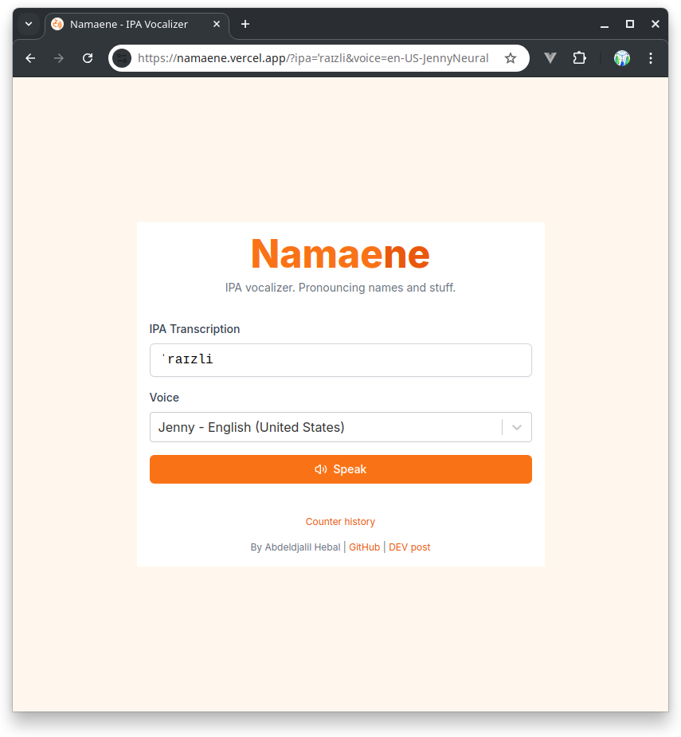
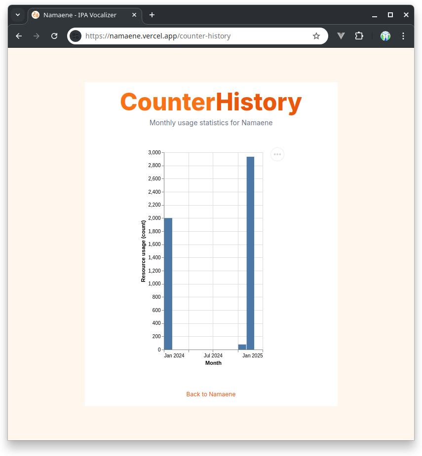
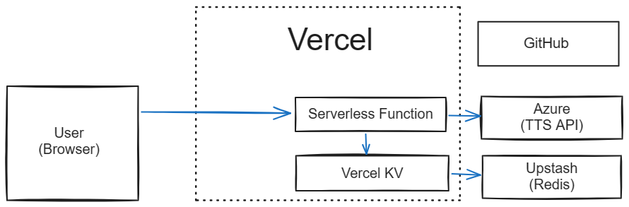

# Namaene

Namaene: IPA vocalizer. Pronouncing names and stuff.

A web app that helps you tell the world how to pronounce your name or whatever.

|  |  |
|:--------------------------------:|:------------------------------------------------:|
| Main page                        | Counter history


## Features

Functionalities or possible improvements.

- [x] **IPA** pronunciation using TTS.

- [x] **Shareable URLs** (saving state in the URL).

- [x] **Caching**.
    * [x] `Cache-Control` public immutable ~~forever~~ for one year.
    * [ ] `ETag` for conditional requests (revalidation) to `/api/speak`.
    * [ ] `Last-Modified` for conditional requests to `/api/voices`.
        + You know, in case the list of supported voices changes during the lifetime of the **current deployment**.
        + For now, we are letting Next handle this: Caching the first response. The route is not dynamic by default.
        + It returns something with `Cache-Control: public, max-age=0, must-revalidate` and a strong `ETag`.

- [x] **Analytics** (Vercel's).


## Usage

## Getting Started

Assuming Azure Speech service's environment variables (`SPEECH_REGION` and `SPEECH_KEY`) defined...

Running the development server:

```sh
npm run dev
```

```sh
# List supported voices
curl -v http://localhost:3000/api/voices

# Before speaking (counter)
curl -v http://localhost:3000/api/counter

# Speaking
ffplay "http://localhost:3000/api/speak?voice=en-US-JennyNeural&ipa=ˈraɪzli"

# Speaking: Scorpion, 3a9rab
ffplay "http://localhost:3000/api/speak?voice=ar-DZ-IsmaelNeural&ipa=ʕaq.rab"

# After speaking (counter)
curl -v http://localhost:3000/api/counter
```

### REST API

```
GET /speak?voice={voice}&ipa={ipa}
    returns binary data
    Content-Type: audio/ogg
    Cache-Control: public, immutable, max-age=31536000
    ETag: strong hash of the request params (IPA and voice)
    Codes: 200, 400

GET /voices
    returns Array<{name, locale, ipaSymbols: null | string[]}>
    Codes: 200

GET /counter
    returns {currentCount: number}
    Codes: 200

GET /counter-history
    returns Array<{[YearMonth]: counterAsString}>
```


## Technologies used

- [x] Microsoft Azure - Speech service (TTS)

- [x] NextJS 14

- [x] Tailwind CSS
    * Because why the hell not. Everyone seems to be using and liking it.

- [x] Vercel (serverless functions and web hosting)

- [x] Redis
    * Vercel KV. Serverless Redis.
    * [x] Testing locally - remote Redis https://vercel.com/docs/storage/vercel-kv/quickstart
    * [ ] Testing locally - local Redis https://github.com/vercel/storage/issues/281

- [x] **SWR**
    * Why need it? Because why the fuck not.
    * https://github.com/vercel/swr
    * https://swr.vercel.app/docs/conditional-fetching
    * We don't need to use conditional fetches.
      Plain `fetch` (the browser actually) should respect cache directives.

- [x] Custom select component.
    * [x] TRY [`react-dropdown-tree-select`](https://github.com/dowjones/react-dropdown-tree-select)
    * [x] TRY [`react-select`](https://github.com/jedwatson/react-select/)
    * [ ] Something better? We need to programmatically set the default option after fetching all options.


## Name

- **Namaene** = **the pronounciation or sound of a name**.
    * **Namae** means "name".
    * **Ne** means "sound" as in Miku Hatsune (first-sound) or Len Kagamine (mirror-sound; mirrored sound as in echo?).

The project's name is a nod to Vocaloid.

- ~~**NaNe**~~: Simplified version, uses _Na_ as in _Kimi no Na wa_.
    * The `nane` subdomain is not available on Vercel.


## Choosing a TTS provider

Requirements:
- Impresses employers.
- SSML support.
- Free _enough_.
(Requires credit card? Fine.
Limited resources? Fine.
Automatically charged after exceeding the free quota? Sucks, but may be manageable.)

Options:

- Amazon Web Service (AWS)
    * SSML? Yes.
        + [Generating Speech from SSML Documents - Amazon Polly](https://docs.aws.amazon.com/polly/latest/dg/ssml.html)
    * Free? Not really. "12 months free". **Not** "free forever".

- Microsoft Azure
    * SSML? Yes.
        + [Speech Synthesis Markup Language (SSML) overview - Speech service - Azure AI services | Microsoft Learn](https://learn.microsoft.com/en-us/azure/ai-services/speech-service/speech-synthesis-markup)
        + [Pronunciation with Speech Synthesis Markup Language (SSML) - Speech service - Azure AI services | Microsoft Learn](https://learn.microsoft.com/en-us/azure/ai-services/speech-service/speech-synthesis-markup-pronunciation)

    * Free? Yes, but is it enough?
        + Text to Speech / 0.5 million characters free per month.
        [Speech Services Pricing](https://azure.microsoft.com/en-us/pricing/details/cognitive-services/speech-services/)

- Google Cloud
    * SSML? Yes.
    * Free? Yes, enough. Requires enabling billing, but _you_ gotta ensure you don't go above the free monthly quota!
        + Free per month / Standard voices / 0 to 4 million characters" (https://cloud.google.com/text-to-speech/pricing)
        + Also, "new customers get $300 in free credits to spend on Text-to-Speech." (https://cloud.google.com/text-to-speech/)


### Fallback

Use some fallback if the API is unusable for whatever reason?

- Local. Use Web Speech API. It should work.
> The text may be provided as plain text, or a well-formed SSML document. The SSML tags will be stripped away by devices that don't support SSML.
> 
> -- https://developer.mozilla.org/en-US/docs/Web/API/SpeechSynthesisUtterance/text

However, when testing with Chrome/Edge v119 on Windows 10 Pro using various builtin engines (local and online), it did not seem to work.
Either the text is spoken as if tags were stripped (like not considering emphasis and IPA phonemes) or it reads the XML file literally.
As of 2023-11-XX, it's buggy, unpredictable, and ultimately unreliable.
See:
- https://github.com/WICG/speech-api/issues/37
- https://stackoverflow.com/questions/21952736/the-right-way-to-use-ssml-with-web-speech-api

Consider using some standalone TTS engine.
<details>
<summary>TTS engines</summary>

- [ ] **eSpeak** 
    * [ ] SSML? Probably.
        + "SSML (Speech Synthesis Markup Language) is supported (not complete), and also HTML."
        -- https://espeak.sourceforge.net (Visited 2023-12-04)
        + It understands IPA (`--ipa` option exists).

    * [ ] Client side (think: compiled to WebAssembly)? Probably, I remember seeing some `asm.js`/Emcripten versions a few years ago.
        * Like https://github.com/kripken/speak.js

- [ ] **Flite**: a small run-time speech synthesis engine
    * [ ] SSML? Probably.
    "New in 2.0.0 (Dec 2014) \[. . .] SSML support"
    -- https://github.com/festvox/flite

    * [ ] Client side?

- [ ] **Festival**
    * https://github.com/festvox/festival

    * [ ] SSML? Not exactly.
        + Apparently it used to support an old version of SSML, but now uses Sable.
        + See [Festival Speech Synthesis System: 10. XML/SGML mark-up](http://festvox.org/docs/manual-2.4.0/festival_10.html#XML_002fSGML-mark_002dup)

    * [ ] Client side?

- [ ] **Mimic**: Mycroft's TTS engine, based on CMU's Flite (Festival Lite)
    * https://github.com/MycroftAI/mimic1

- [ ] **eSpeak NG**
    * https://github.com/espeak-ng/espeak-ng

</details>


## Design

### Constraints

- Limited quota. We want to optimize and cache whenever possible.

- No money to spend.
Meaning, we should not Google Cloud's [Apigee][google-apigee] (non-free) or Billing API (it can and prob will pause our usage **after** we exceed the quota, [check the docs][google-billing-stop]).

[google-apigee]: https://cloud.google.com/apigee

[google-billing-stop]: https://cloud.google.com/billing/docs/how-to/notify#cap_disable_billing_to_stop_usage

### Assumptions

- Only this project uses the TTS resource.
    * Note: Can be improved, but let's keep it simple for now.

- The client respects cache control directives.
    * Not required, but nice.
    * Browsers respect them (unless overriden).
    * Other clients like `curl` and `ffplay` do not.

### How it should work

Fail fast.

- Assert that the request is valid, otherwise return a client error (`400 Bad Request`)

- Let cacheKey = the checksum of the request params (ipaText, voice, etc.) using cannonical JSON maybe.

- If request is conditional, and if its [ETag][mdn-ETag] equals `cacheKey`, return a response indicating it's not changed (`304 Not Modified`).
Also, include whatever headers that tell the client to cache it forever.

- If reached quota, return a server error (`503 Service Unavailable`).

- Call the TTS API, it returns some audio data. Return it as body plus the content-type header.

[mdn-ETag]: https://developer.mozilla.org/en-US/docs/Web/HTTP/Headers/ETag



### Handling quota

Using Redis.

**What to count**
- Google says `<mark>` are stripped, but that doesn't matter. We don't care since we are only using a single `<phoneme>` tag.
- We can just use `TextEncoder` and count bytes. Again, better be safe than sorry.

> **Note:**
> For WaveNet and Standard voices, the number of characters will be equal to or less than the number of bytes represented by the text. This includes alphanumeric characters, punctuation, and white spaces. Some character sets use more than one byte for a character. For example, Japanese (ja-JP) characters in UTF-8 typically require more than one byte each. In this case, you are only charged for one character, not multiple bytes.
>
> -- [Pricing | Cloud Text-to-Speech | Google Cloud](https://cloud.google.com/text-to-speech/pricing)

For example, the string `その名前をさあ、言ってごらん このぼくの名前を！`
- 24 characters  (if we count using UTF-16, which is what JavaScript uses to encode string).
- 70 bytes (if we encode the string in UTF-8 and then count).

IPA texts won't be this "extreme" though.

**Counting**

Whenever a request arrives, count how characters it will use (`charsInRequest`)
then `INCRBY charactersUsed charsInRequest`.
If the total `charactersUsed is >= CHARACTERS_MAX`, we ~~should~~ must not make a call to Google Cloud's TTS API.

**Resetting**

Thoughts:
- Google Cloud quotas reset monthy.
- So we can either use a cron job (supported by Vercel) to reset it at the start of each month.
Or we could store the current month in Redis and run a transaction to do something like the following pseudocode:
```
MULTI

Get current month as YYYY-MM
Get stored month
If current month > stored month
    set stored month = current month
    set charactersUsed = 0

EXEC
```
Where and when to run it though? Again, TBD.

**Notes**:

- "KV databases owned by users on a Hobby plan will be deleted after 30 days of being idle." - [Vercel KV Limits](https://vercel.com/docs/storage/vercel-kv/limits)
    * This is fine. Google Cloud's quota will reset, assuming only this project uses it.

- I am aware that [`INCRBY`][redis-INCRBY] returns the value _after_ incrementing it.
    * This is fine. Better be safe than sorry.
    Suppose the limit is 1000 chars. We already used 900, but the request will only use 100 chars.
    We could make it, but, eh, might as well stop at N-1. One last request is not important.

Is using `INCRBY counter:yyyy-mm` a waste of storage (space quota)?
Not really, we can think of it as an opportunity to implement another feature:
Maintaining a historical record of monthly counts

[redis-INCRBY]: https://redis.io/commands/incrby/

### Gotchas

You may need to find a language or voice that pronounces the IPA properly. Not every TTS/voice has all sounds.

We are doing something similar to this:
- [How do I create an expressjs endpoint that uses azure tts to send audio to a web app? - Stack Overflow](https://stackoverflow.com/a/69345575)

- [Audio outputs / Text to speech API reference (REST) - Speech service - Azure AI services | Microsoft Learn](https://learn.microsoft.com/en-us/azure/ai-services/speech-service/rest-text-to-speech?tabs=streaming#audio-outputs)


## Details

- [Ramblings](./Ramblings.md)

- [About **Azure TTS**](docs/azure.md)

- [About **Google Cloud TTS**](docs/google-cloud.md)


## Related projects

- **IPA Reader** by Katie

    * http://ipa-reader.xyz/

    * [Pronouncing Things with Amazon's Polly - Cuttlesoft, Custom Software Developers](https://cuttlesoft.com/blog/2018/09/13/pronouncing-things-with-amazons-polly/)

    * https://gist.github.com/katie7r/f6e51f345e4c46738514cdeba31fb167
    
    * Notes:
        - Uses AWS (Polly, S3, and idk).
        - Written in Python and uses **Amazon AWS SDK for Python** (Boto3).
        - They pay for it.

    * Others:
    
        + [Excellent IPA reader website I found: : r/conlangs](https://www.reddit.com/r/conlangs/comments/jbk7o4/excellent_ipa_reader_website_i_found/)

        + About IPA-Reader.xyz, phoneme-synthesis, and Pink Trombone
        https://www.reddit.com/r/linguistics/comments/w8mxuc/ipa_reader/


- **phoneme-synthesis** https://github.com/itinerarium/phoneme-synthesis

    * "A browser-based tool to convert International Phonetic Alpha (IPA) phonetic notation to speech using the meSpeak.js package"

    * https://itinerarium.github.io/phoneme-synthesis/

        + "The IPA phonetic notation is translated into phonemes understood by eSpeak using correspondences and logic found in lexconvert. The translated phonemes (e.g., `[[mUm'baI]]` for `/mʊmˈbaɪ/`) are then provided to meSpeak.js, a revised Emscripten'd version of eSpeak for output."

        + [ ] KAITO: Doesn't eSpeak support IPA?

    * [ ] RECHECK: Feedback wanted: convert phonetic notation text to speech : linguistics
    https://www.reddit.com/r/linguistics/comments/5lwuc7/

- **IPA to Speech** (IPA Reader) by Anton Vasetenkov

    * https://www.antvaset.com/ipa-to-speech

    * 2023-12-11 Visited.

    * Not open source, uses React I guess.

    * "The tool uses the Google Cloud Text-to-Speech API, Amazon Polly, and Microsoft Azure Azure Cognitive Services Speech Service to generate the speech audio from the phonetic input."

    * Liked the intro.


## Further reading

- [IPA i-charts](https://www.internationalphoneticassociation.org/IPAcharts/inter_chart_2018/IPA_2018.html)
Interactive chart with audio recordings.


## Credits

- Developed with [Next.js](https://nextjs.org/), bootstrapped with `create-next-app`.

- [**Speech** by Deivid Sáenz from Noun Project (CC BY 3.0)](https://thenounproject.com/icon/speech-82581/)


## License

[CC BY 4.0](https://creativecommons.org/licenses/by/4.0/) © Abdeldjalil HEBAL
