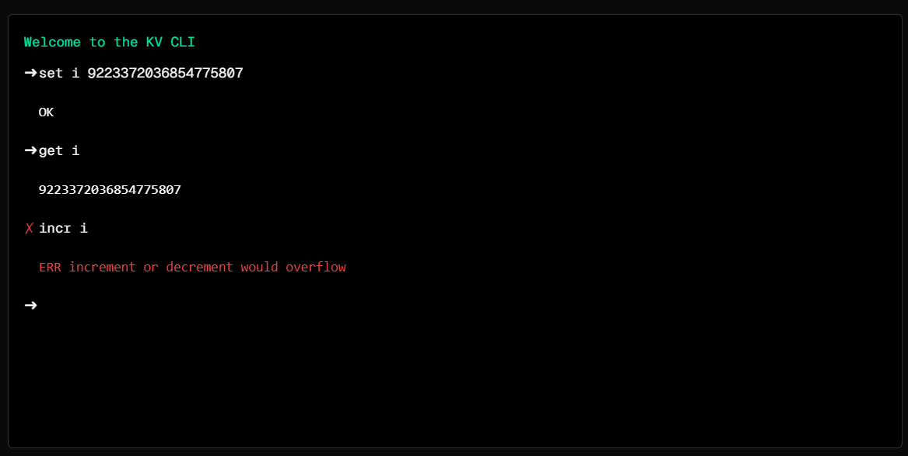

# About Redis

- [Transactions | Redis](https://redis.io/docs/interact/transactions/)

- [x] `HGETALL` https://redis.io/commands/hgetall/

- [x] SKIM: [Redis / Get all keys & values from redis with prefix | Stack Overflow](https://stackoverflow.com/questions/30728973/)

- [ ] READ: [Using Redis HASH instead of SET to reduce cache size and operating costs - Salesforce Engineering Blog](https://engineering.salesforce.com/using-redis-hash-instead-of-set-to-reduce-cache-size-and-operating-costs-2a1f7b847ded/)

- Integer overlow?
    * TLDR: No.
    * See: [What happens when Int64 maxvalue is exceded with Redis INCR | Stack Overflow](https://stackoverflow.com/questions/36861472/)

---

- [ ] [How to use Redis for real-time metering applications | InfoWorld](https://www.infoworld.com/article/3230455/how-to-use-redis-for-real-time-metering-applications.html)
